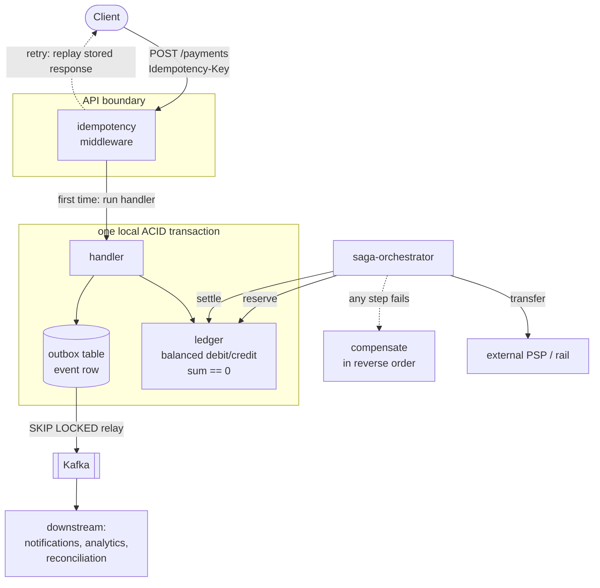

# Artur Smirnov — Senior Go Engineer, Payments & High-Load Systems

Four years building backend for payments (six years with Go overall):
payout processing, ledger consistency, and integrations with third-party
payment service providers that fail in every way a distributed system can fail.

The repos below are one continuous idea, not four unrelated demos: **how to move
money exactly once across services that don't share a database and can't use
two-phase commit.** Each one solves a different link in that chain — a retried
request, a balance that must always sum to zero, an event that can't be lost, a
multi-step transfer that must never be left half-applied.

## Pinned — the exactly-once money-movement stack

| Repo | What it's for |
|---|---|
| [`idempotency`](https://github.com/smirnov-artur/idempotency) | `Idempotency-Key` HTTP middleware — a retried `POST /payments` replays the stored response instead of charging twice; in-memory + Postgres stores, concurrent-request handling, table-driven tests under `-race` |
| [`ledger`](https://github.com/smirnov-artur/ledger) | Double-entry ledger — every movement is balanced debit/credit entries, `sum(entries) == 0` enforced as an invariant; balances are derived from an append-only log, never mutated in place |
| [`outbox`](https://github.com/smirnov-artur/outbox) | Transactional outbox — the event is written in the *same* transaction as the state change, so there's no dual-write race with the broker; `SKIP LOCKED` relay poller, at-least-once delivery, consumer-side dedup |
| [`saga-orchestrator`](https://github.com/smirnov-artur/saga-orchestrator) | Saga coordinator for `reserve → transfer → settle` without 2PC — persisted state machine, compensations in reverse order, idempotent steps, crash recovery from the persisted position |

Standard-library-first, dependency-light, real benchmarks and `-race` CI on each.

## How these fit together

A single payout is one request that fans out into a ledger write, a durable
event, and — when it touches an external rail — a multi-step saga. The four
repos are the seams between those parts:

- **idempotency** guards the entrance: an at-least-once transport means retries
  are inevitable, so the API boundary deduplicates before anything touches money.
- **ledger** is the source of truth: a movement is only valid if its entries sum
  to zero, which makes double-spend a schema violation rather than a bug you hope
  to catch in review.
- **outbox** gets the event out of the primary database without a dual-write
  race — the state change and the "it happened" event commit atomically.
- **saga-orchestrator** sequences the steps a single transaction can't span
  (a local ledger reserve, an external PSP call, a settle), and unwinds cleanly
  with compensations when a later step fails.

## Stack

Go, PostgreSQL, Kafka, ClickHouse, gRPC/REST, Docker, Kubernetes.
Distributed-systems primitives: idempotency, exactly-once delivery,
transactional outbox, saga/compensation, circuit breakers, DLQs.

## Contact

- Email: paladei702@gmail.com
- Telegram: [@smirnovarturr](https://t.me/smirnovarturr)
- GitHub: [smirnov-artur](https://github.com/smirnov-artur)
- Book a 30-min call: https://cal.com/paladei-rxmf8b/30min

Open to remote Go roles.
