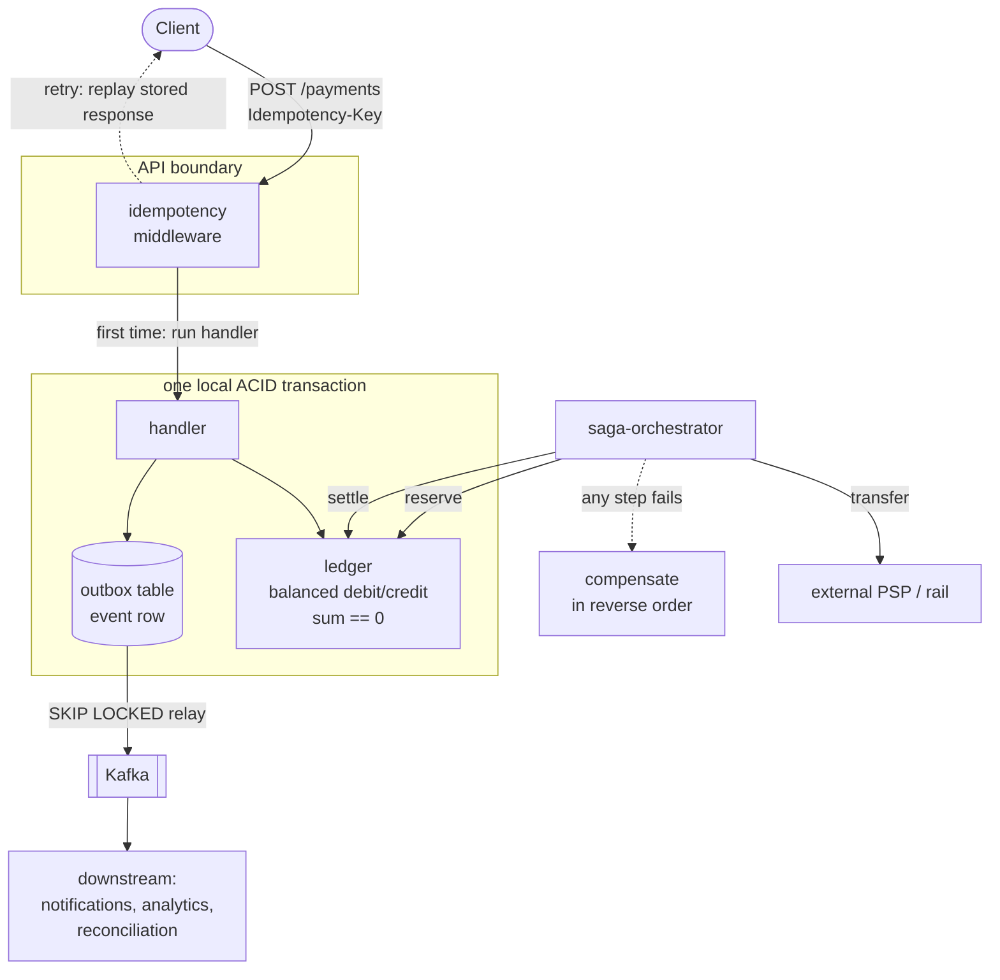

# Artur Smirnov — Senior Go Engineer, Payments & High-Load Systems

Four years building backend for payments (six years with Go overall):
payout processing, ledger consistency, and integrations with third-party
payment service providers that fail in every way a distributed system can fail.

The repos below are one continuous idea, not four unrelated demos: **how to move
money exactly once across services that don't share a database and can't use
two-phase commit.** Each one solves a different link in that chain — a retried
request, a balance that must always sum to zero, an event that can't be lost, a
multi-step transfer that must never be left half-applied.

## Pinned — the exactly-once money-movement stack

| Repo | What it's for |
|---|---|
| [`idempotency`](https://github.com/smirnov-artur/idempotency) | `Idempotency-Key` HTTP middleware — a retried `POST /payments` replays the stored response instead of charging twice; in-memory + Postgres stores, concurrent-request handling, table-driven tests under `-race` |
| [`ledger`](https://github.com/smirnov-artur/ledger) | Double-entry ledger — every movement is balanced debit/credit entries, `sum(entries) == 0` enforced as an invariant; balances are derived from an append-only log, never mutated in place |
| [`outbox`](https://github.com/smirnov-artur/outbox) | Transactional outbox — the event is written in the *same* transaction as the state change, so there's no dual-write race with the broker; `SKIP LOCKED` relay poller, at-least-once delivery, consumer-side dedup |
| [`saga-orchestrator`](https://github.com/smirnov-artur/saga-orchestrator) | Saga coordinator for `reserve → transfer → settle` without 2PC — persisted state machine, compensations in reverse order, idempotent steps, crash recovery from the persisted position |

Standard-library-first, dependency-light, real benchmarks and `-race` CI on each.

## How these fit together

A single payout is one request that fans out into a ledger write, a durable
event, and — when it touches an external rail — a multi-step saga. The four
repos are the seams between those parts:

```mermaid
flowchart TD
    client([Client]) -->|POST /payments<br/>Idempotency-Key| idem

    subgraph api [API boundary]
        idem[idempotency<br/>middleware]
    end

    idem -->|first time: run handler| tx
    idem -.->|retry: replay stored response| client

    subgraph db [one local ACID transaction]
        tx[handler]
        tx --> ledger[ledger<br/>balanced debit/credit<br/>sum == 0]
        tx --> outbox[(outbox table<br/>event row)]
    end

    outbox -->|SKIP LOCKED relay| kafka[[Kafka]]
    kafka --> consumers[downstream:<br/>notifications, analytics,<br/>reconciliation]

    saga[saga-orchestrator] -->|reserve| ledger
    saga -->|transfer| psp[external PSP / rail]
    saga -->|settle| ledger
    saga -.->|any step fails| compensate[compensate<br/>in reverse order]
```

- **idempotency** guards the entrance: an at-least-once transport means retries
  are inevitable, so the API boundary deduplicates before anything touches money.
- **ledger** is the source of truth: a movement is only valid if its entries sum
  to zero, which makes double-spend a schema violation rather than a bug you hope
  to catch in review.
- **outbox** gets the event out of the primary database without a dual-write
  race — the state change and the "it happened" event commit atomically.
- **saga-orchestrator** sequences the steps a single transaction can't span
  (a local ledger reserve, an external PSP call, a settle), and unwinds cleanly
  with compensations when a later step fails.

## Stack

Go, PostgreSQL, Kafka, ClickHouse, gRPC/REST, Docker, Kubernetes.
Distributed-systems primitives: idempotency, exactly-once delivery,
transactional outbox, saga/compensation, circuit breakers, DLQs.

## Also: interactive 3D for the browser

A second, self-contained line of work — real-time 3D on the web, where the hard
part is not the render loop but keeping a configurator correct while a real
catalogue changes under it.

**Live site: [smirnov-artur.github.io/webgl](https://smirnov-artur.github.io/webgl)** — everything below runs in the browser, no install.

### Latest

- **[SLOWLIGHT](https://smirnov-artur.github.io/slowlight/)** — the biography of one photon: an interactive scroll essay drawn by a single hand-written WebGL2 shader. Vanilla JS, zero dependencies, zero images.
- **[BLOCKSMITH](https://smirnov-artur.github.io/portfolio/cases/blocksmith/en/)** — a page a Minecraft-style builder assembles in front of you: letter-by-letter headlines, a timelapse world under the sheet, a scroll-driven mine cross-section. Three.js, no framework.

| Work | What it does |
|---|---|
| **STANDES** | 3D shelving configurator — the client lays out rows over a real floor plan, checks the result in AR on site from a phone, and exports the layout as a spec |
| **Ventprom** | Parametric configurator for duct fittings — input parameters build the geometry and return a live preview with a priced spec |
| **Ventmarket** | Equipment selection by operating point across a 400+ item catalogue, ending in a generated specification |
| **Dios** | Fleet globe on Three.js — ship and aircraft routes rendered in real time with custom atmosphere and trail shaders |
| **Vertro** | A legacy VB6 + Access engineering suite rebuilt as a web app with nine calculation modules |

Shader demos, hand-written GLSL: [AURUM](https://smirnov-artur.github.io/portfolio/cases/aurum) (bronze sculpture on raw shaders, camera orbits on scroll), [Ferro](https://smirnov-artur.github.io/portfolio/cases/ferro) (liquid cursor revealing a second image), [Fluxwave](https://smirnov-artur.github.io/portfolio/cases/flux) (neon hero with custom cursor physics).

Stack here: Three.js, WebGL, hand-written GLSL, React Three Fiber, TypeScript, GSAP.
Design and code in one pair of hands, so a scene never stalls between a designer
and a front-end dev.

Available for contract work on 3D configurators and interactive sites.

## Contact

- Email: paladei702@gmail.com
- Telegram: [@smirnovarturr](https://t.me/smirnovarturr)
- GitHub: [smirnov-artur](https://github.com/smirnov-artur)
- Book a 30-min call: https://cal.com/paladei-rxmf8b/30min

Open to remote Go roles.
